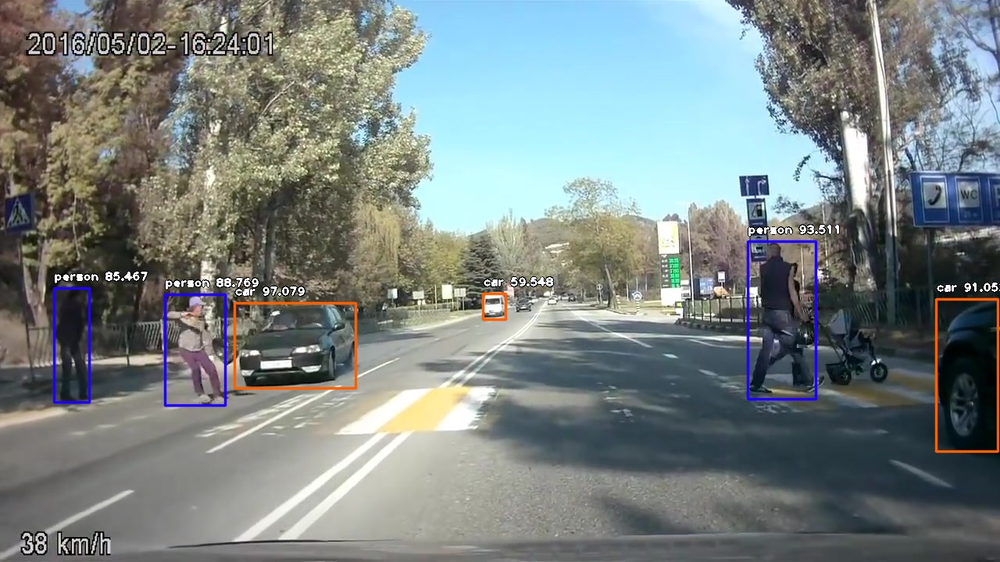

# Car-Crash-Detector
 Car Crash Detector based on CNN + HRNN (Hierarchical Recurrent Neural Network) architecture to detect and predict Accidents from dash cam video feed
# Approach
The problem is solved in two parts. First is object detection and second is creating a model to detect and hence predict accidents from video feed.
# Part 1: Object Detection
Object Detection is done using retinanet.
 
Sample output of Object Detector:

 
# Part 2: Accident Prediction
 
A custom CNN + HRNN (Hierarchical Recurrent Neural Network) model was trained on dataset created by By Fu-Hsiang Chan, Yu-Ting Chen, Yu Xiang, Min Sun.
Reference to dataset:
 
@inproceedings{chan2016anticipating,
    title={Anticipating accidents in dashcam videos},
    author={Chan, Fu-Hsiang and Chen, Yu-Ting and Xiang, Yu and Sun, Min},
    booktitle={Asian Conference on Computer Vision},
    pages={136--153},
    year={2016},
    organization={Springer}
}
 
# Authors
Author: Omkar Sarde os4802@rit.edu / omkarsarde1995@gmail.com
 
Author: Sharwari Salunkhe ss3398@rit.edu / sharvari311095@gmail.com
